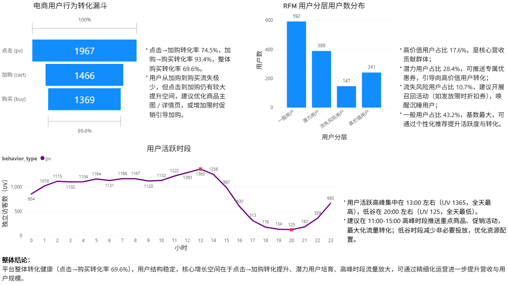

# 淘宝用户行为数据分析

## 项目简介

本项目基于阿里天池提供的淘宝用户行为数据集，使用 **MySQL** 完成数据导入与基础指标计算，利用 **Python** 实现 RFM 用户分层，并通过 **Power BI** 进行可视化分析。目的是模拟电商数据分析师的工作流程，从数据清洗、指标计算到业务洞察，展现数据分析全链路能力。

## 数据集

- **来源**：[阿里天池 - User Behavior Data](https://tianchi.aliyun.com/dataset/649)
- **原始规模**：约 1 亿条用户行为记录（压缩包 905MB，解压后约 3GB）
- **抽样数据**：使用 Python 抽取前 20 万行作为样本（`UserBehavior_sample.csv`），便于本地分析。
- **字段说明**：

| 字段 | 类型 | 说明 |
|------|------|------|
| user_id | INT | 用户ID |
| item_id | INT | 商品ID |
| category_id | INT | 商品类目ID |
| behavior_type | VARCHAR(10) | 行为类型（pv / cart / fav / buy） |
| timestamp | INT | 行为发生的 Unix 时间戳（秒） |

## 数据准备（导入 MySQL）

1. **下载并抽样**：从天池下载原始数据，使用 Python 读取前 20 万行，生成样本 CSV。
2. **创建表**：在 MySQL 中创建 `user_behavior` 表，结构见 `sql/create_table.sql`。
3. **导入数据**：通过 HeidiSQL 导入向导将样本数据导入 MySQL。

## SQL 分析（核心指标）

所有分析查询保存在 `sql/analysis_queries.sql` 中，主要计算以下指标：

- **PV/UV**：总点击次数与独立访客数
- **转化漏斗**：点击 → 加购 → 购买的独立用户数及转化率
- **用户活跃时段分布**：按小时统计点击行为
- **复购率**：购买次数≥2的用户占比

### 关键发现（基于抽样数据）

| 指标 | 数值 |
|------|------|
| 总点击量（PV） | 179,831 次 |
| 独立访客数（UV） | 1,967 人 |
| 点击用户数 | 1,967 |
| 加购用户数 | 1,466 |
| 购买用户数 | 1,369 |
| 点击 → 加购 转化率 | 74.5% |
| 加购 → 购买 转化率 | 93.4% |
| 整体购买转化率（点击→购买） | 69.6% |
| 复购率（购买≥2次用户占比） | 66.5% |
| 用户活跃高峰时段 | 下午 13:00-14:00（16,009 次点击） |

**用户活跃时段分布（按小时点击量，前5名）**：

| 小时 | 点击量 |
|------|--------|
| 13:00 | 16,009 |
| 14:00 | 15,145 |
| 12:00 | 13,882 |
| 11:00 | 11,569 |
| 15:00 | 10,524 |

> *注：活跃时段集中在 11:00-15:00，与午间及午后购物习惯吻合。*

## Python RFM 用户分层

使用 **RFM 模型**（Recency, Frequency）对购买用户进行分层，代码见 `python/rfm_analysis.ipynb`。

### 分层规则
- **高价值用户**：R 近（R_score≥4）且 F 高（F_score≥4）
- **潜力用户**：R 近但 F 低
- **流失风险用户**：R 远但 F 高
- **一般用户**：R 远且 F 低

### 分层结果（基于 1369 个购买用户）

| 用户层级 | 用户数 | 占比 |
|----------|--------|------|
| 高价值用户 | 241 | 17.6% |
| 潜力用户 | 389 | 28.4% |
| 流失风险用户 | 147 | 10.7% |
| 一般用户 | 592 | 43.2% |

**业务建议**：
- 对高价值用户提供专属优惠，维持忠诚度。
- 对潜力用户推送个性化推荐，提升复购。
- 对流失风险用户进行召回活动（如发放优惠券）。

## Power BI 可视化看板



**核心结论**：
- 用户活跃高峰集中在 13:00-14:00，建议在该时段推送重点商品或促销信息。
- 点击→加购转化率 74.5%，加购→购买转化率 93.4%，整体购买转化率 69.6%。
- 高价值用户占比 17.6%，贡献了大部分复购；潜力用户占比 28.4%，可通过优惠券刺激转化；流失风险用户占比 10.7%，需定向召回。

## 文件结构
```
ecommerce-user-behavior-analysis/
├── README.md # 项目说明
├── .gitignore # Git 忽略文件
├── sql/
│   ├── create_table.sql # 建表语句
│   └── analysis_queries.sql # SQL 分析查询
├── python/
│   ├── rfm_analysis.ipynb # RFM 分析 Jupyter Notebook
│   └── rfm_result.csv # RFM 输出结果
└── powerbi/
    └── dashboard_preview.png # Power BI 看板截图
```

## 环境要求

- MySQL 8.0
- Python 3.8+（pandas, pymysql, matplotlib）
- Power BI Desktop

## 参考链接

- 阿里天池数据集：[User Behavior Data](https://tianchi.aliyun.com/dataset/649)
- GitHub 仓库：[wyz03/ecommerce-user-behavior-analysis](https://github.com/wyz03/ecommerce-user-behavior-analysis)

---

*注：项目持续完善中，欢迎交流。*